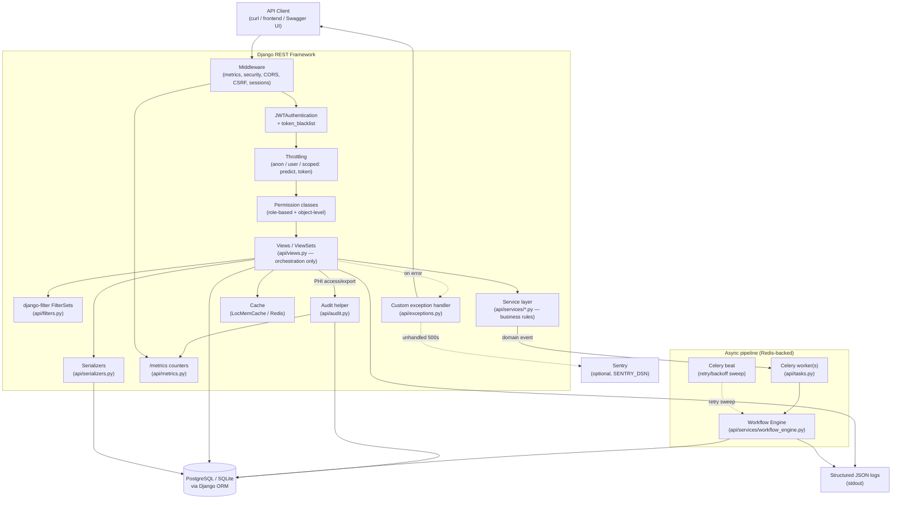

# CareFlow API

CareFlow is a Django REST API for patient operations, explainable triage risk scoring, alerting, scheduling, and analytics. It models a real hospital/community-care operational workflow — wards, beds, admissions, medication and lab orders, referrals — behind role-based, JWT-authenticated endpoints, with an event-driven rule engine for automating downstream actions (alerts, follow-ups, referrals).

This is a solo-built backend portfolio project. There is no bundled frontend beyond a single read-only stats page (`/`); the surface area is the API itself, documented via OpenAPI/Swagger at `/api/docs/`.

## Who This Is For

**Primary user: hospital clinical staff (clinicians, charge nurses, admins).**
Their workflow is the inpatient lifecycle this API models end-to-end: admit a
patient to a bed, order medications and labs, respond to auto-generated
clinical alerts, transfer/discharge, and review hospital-flow analytics
(occupancy, pending labs, active orders). Role-based permissions
(`ClinicalWritePermission`, `MedicationOrderPermission`, etc. — see
`api/permissions.py`) are built around what this group is and isn't allowed
to change.

**Secondary user: community outreach coordinators.**
Their workflow is community-health, not hospital-ops: remote-monitoring
check-ins, resource referrals (housing, food, mental health, transport),
and the impact-analytics endpoint that reports on referral outcomes and
urgent check-in volume. `CommunityWorkflowPermission`/`PatientCheckInPermission`
scope this group to a materially different (and narrower) slice of the
domain than clinical staff — outreach workers can only edit referrals/
check-ins they personally created, while clinicians/admins can act across
the whole care team's records.

**Tertiary / demonstration user: an anonymous visitor.**
`POST /api/v1/predict/health-risk/` is deliberately `AllowAny` so a
portfolio reviewer (or a real prospective patient on a public-facing
triage tool) can try the explainable risk-scoring model without an
account — throttled separately from the authenticated API to resist abuse.

## Success Metrics

Concrete, if modest, targets this project would be evaluated against in a
real deployment (not measured against live production traffic here, since
none exists — see "Known Tradeoffs"):

- **P95 API latency < 300ms** for any single-resource read/write endpoint
  under normal (non-abusive) load. `docs/load-test.md` shows this holds
  through ~50 concurrent simulated users on a single dev-server process;
  a real Gunicorn/Postgres deployment should comfortably clear this.
- **Zero unaudited PHI-adjacent write** — every Patient/MedicationOrder/
  Admission create, update, and delete is recorded in `AuditLog` (see
  "Audit Logging" below). This is a correctness target, not a
  performance one, and is enforced by the test suite
  (`test_patient_create_update_delete_are_all_audited`, etc.), not just
  aspirational.
- **100% of destructive/state-changing endpoints covered by a negative-path test** —
  every permission boundary (RBAC + object-level ownership) has a
  corresponding test that specifically attempts the denied action and
  asserts the 403, not just a happy-path test that never tries it.
- **Coverage floor enforced in CI, not just measured** — `--fail-under=70`
  in `.github/workflows/ci.yml`; actual measured coverage is currently 93%
  (see `coverage report -m`), comfortably above the gate.
- **A breaking API change should be shippable without an existing
  integration silently breaking** — the reason `/api/v1/` versioning and
  the OpenAPI schema-drift CI check (see "API Versioning & Deprecation
  Policy") exist.

## Competitive Analysis / Prior Art

CareFlow is not attempting to compete with or replace a real EHR/care-
coordination platform (Epic, Cerner, athenahealth, or open-source
alternatives like OpenMRS). Naming what those systems do that this
project deliberately does not, and why:

- **Epic/Cerner/athenahealth** are comprehensive, regulatory-certified
  (ONC/CMS in the US) EHR platforms covering billing, insurance claims,
  clinical documentation templates, e-prescribing to real pharmacies,
  interoperability standards (HL7/FHIR), and years of compliance
  certification work. CareFlow implements none of this — it is a
  narrower demonstration of the *operational* layer (admissions, orders,
  scheduling, alerting, referrals) without the billing/compliance/
  interoperability surface a real EHR is legally required to have.
- **OpenMRS** (open-source EHR) is architecturally closer in spirit
  (concept dictionary, modular forms) but is a multi-year, multi-
  contributor platform; CareFlow is intentionally a single-contributor,
  demo-data-scale project meant to demonstrate specific backend
  engineering practices (RBAC, audit trails, event-driven automation,
  observability, testing discipline) rather than to be clinically
  deployable.
- **What CareFlow demonstrates that a "toy CRUD API" portfolio project
  usually doesn't:** an event-driven automation engine with data-defined
  rules (not hardcoded `if` chains), object-level authorization with
  negative-path tests, an append-only audit trail, and now (this pass) a
  service-layer separation between HTTP orchestration and business logic
  that mirrors how a real backend team would structure this as it grew
  past a single contributor.
- **Explicit non-goal:** clinical decision support beyond the
  transparent, explainable triage-scoring demo (`_score_health_risk` →
  `api/services/triage.py`). This is not a diagnostic tool and does not
  claim clinical validity — it demonstrates API design and explainability
  (`key_drivers` in every response), not predictive-modeling research.

## Portfolio Features

- JWT-authenticated patient records and care-plan generation, with a token blacklist logout endpoint
- Role-based access control (admin, clinician, outreach) enforced by 10+ differentiated permission classes, including object-level ownership checks on referrals, check-ins, and medication orders
- Explainable triage scoring (`risk_score`, `risk_level`, top key drivers) — a transparent weighted-rule formula, not a trained ML model (see Known Tradeoffs)
- Persistent risk assessments and automatic high-risk alerts
- Appointment scheduling workflow
- Remote monitoring check-ins with automatic urgent escalation
- Community resource directory + patient referral workflows
- Patient journey and community recommendation endpoints
- Full inpatient hospital flow: wards, beds, admissions, transfers, discharge
- Medication ordering lifecycle and lab workflow (ordered -> in progress -> completed)
- Event-driven workflow automation engine (domain events + configurable rules), dispatched asynchronously via Celery + Redis where configured
- Analytics dashboard endpoint for KPIs + trend data, short-TTL cached
- Social impact analytics for referrals and vulnerable check-ins, short-TTL cached
- Hospital flow analytics for occupancy and operational KPIs, short-TTL cached
- Paginated, filterable (via `django-filter`), sortable list endpoints across every resource
- Audit trail for PHI-adjacent access, create, update, and delete (patient records, medication orders, admissions, risk-assessment exports)
- Structured JSON logging, optional Sentry error tracking + performance tracing, and a minimal counter-based `/metrics` endpoint
- CSV export for risk assessments (audited)
- URL-path API versioning (`/api/v1/`) with a documented deprecation policy
- OpenAPI schema + Swagger docs, with a CI contract test guarding against undocumented schema drift
- Polished portfolio homepage at `/`

## Architecture

CareFlow follows a conventional layered Django/DRF structure. Views are thin orchestrators; validation lives in serializers; business rules live in a dedicated `api/services/` layer (triage scoring, alerting, recommendations, admission/medication/lab-order lifecycle, workflow-rule automation); cross-cutting concerns (authorization, audit, throttling, caching) are composed onto views rather than duplicated inside them.



Request flow in words: every request passes through a metrics-counting middleware, Django's security middleware, then DRF's JWT authentication, then throttling (a blanket rate plus tighter scoped rates on the token and public-prediction endpoints), then role/object-level permission checks, and finally the view. Views delegate validation to serializers, delegate query-param filtering to declared `django-filter` FilterSets, delegate business-rule automation to the `api/services/` layer (never inline `if` chains for cross-cutting rules), and call the audit helper explicitly at the call sites that touch PHI-adjacent data. Domain events (triage assessed, admission created/transferred/discharged, lab completed, check-in submitted) are dispatched to a Celery task; in any environment with `REDIS_URL` configured, a separate worker process picks them up asynchronously, and `CELERY_BEAT_SCHEDULE` periodically sweeps anything that failed or fell through via `process_pending_domain_events`. In local dev/CI (no Redis), `CELERY_TASK_ALWAYS_EAGER=True` runs the exact same code synchronously in-process, so no extra infrastructure is required to develop or test the app. Any exception DRF would normally handle is reshaped by a single custom exception handler into one consistent response envelope before it reaches the client.

### Entity-Relationship Diagram

A generated ERD (via `django-extensions graph_models`, rendered with Graphviz) is available at [`docs/erd.svg`](docs/erd.svg); the source `docs/erd.dot` can be regenerated with:

```bash
python manage.py graph_models api --dot -o docs/erd.dot
dot -Tsvg docs/erd.dot -o docs/erd.svg
```

It covers all 15 models, including the `AuditLog` and `WorkflowRule`/`DomainEvent` automation tables.

## Service Layer

Business rules live in `api/services/`, mirroring the pattern
`api/services/workflow_engine.py` already established, applied
consistently everywhere else in this pass:

| Module | Owns |
|---|---|
| `triage.py` | Explainable risk-scoring algorithm + named weight/threshold constants |
| `alerts.py` | Check-in clinical-alert decision rules + alert resolution-timestamp sync |
| `assessments.py` | Persisting a triage assessment + reacting to it (alert, domain event) |
| `recommendations.py` | Community-resource recommendation + auto-referral creation |
| `care_plans.py` | Patient "next actions" care-plan logic |
| `admissions.py` | Admission create/transfer/discharge state machine + bed assignment |
| `medications.py` | Medication-order status transitions |
| `lab_orders.py` | Lab-order start/complete transitions |
| `checkins.py` | Check-in submission + alerting + domain-event emission |
| `workflow_engine.py` | Domain-event/rule matching and execution (pre-existing) |

Views (`api/views.py`) parse/validate the HTTP request, call into one of
these modules, and shape the HTTP response — they do not themselves decide
*what* a valid admission, a triage score, or an urgent check-in is.

## Known Tradeoffs

Documenting these explicitly rather than leaving them implicit, per the principle that a project claiming production-readiness should also show awareness of where it draws the line.

- **SQLite in dev, Postgres in prod/CI.** SQLite requires zero setup for a portfolio reviewer running this locally in under a minute; Postgres is used in CI/production because it matches the target deployment (Render) and supports the concurrent-write patterns (bed assignment, domain-event processing) that SQLite's single-writer model handles poorly under load. `DATABASE_SSL_REQUIRE` is a separate, explicit setting (not derived from `DEBUG`) precisely because "does this Postgres need TLS" is a property of where it's hosted, not of the debug flag — see `careflow/settings.py`.
- **Celery falls back to synchronous, in-process execution when `REDIS_URL` is unset.** Local dev and CI never run a Redis broker or Celery worker; `CELERY_TASK_ALWAYS_EAGER=True` in that case executes `process_domain_event_task.delay(...)` synchronously, identical in effect to this project's pre-Celery behavior. This means the *code path* for async dispatch is real and exercised in every test run, but the *actual latency win* of taking workflow-rule execution off the request thread is only real once `REDIS_URL` is configured — see `docs/load-test.md` Finding 4, which states this limitation plainly rather than implying a benchmark that wasn't actually run.
- **Analytics caching uses a short, fixed 60-second TTL rather than invalidate-on-write.** Simpler to reason about and implement than tracking every write path that could affect an aggregate (admissions, referrals, check-ins, assessments), at the cost of up to 60 seconds of staleness on a dashboard. Acceptable for KPI/trend dashboards; would not be acceptable if this cache were guarding a decision that needed real-time accuracy.
- **The `/metrics` endpoint is a small, fixed set of hand-rolled counters, not full Prometheus/APM instrumentation.** No request-latency histograms, no per-endpoint labels, no distributed tracing. This was a deliberate scope decision (see `api/metrics.py` docstring) — the counters answer "is this deployment seeing traffic and how much of it is erroring," which is a real but narrow slice of observability. Full OpenTelemetry tracing was evaluated and intentionally deferred rather than half-implemented — see "Future Improvements."
- **Hand-rolled `django-filter` FilterSets are declared per-resource rather than fully generic.** Each `FilterSet` in `api/filters.py` still requires a small amount of per-model boilerplate (custom `NumberFilter`/`BooleanFilter` declarations for non-trivial lookups); this is normal `django-filter` usage, not a shortcut, but it does mean adding a new filterable field is a two-line diff (model field + FilterSet field) rather than fully automatic.
- **Rule-based triage scoring, not a trained ML model.** `score_health_risk` (`api/services/triage.py`) is a transparent, explainable weighted-sum formula over clinically-motivated factors (age, BMI, blood pressure, cholesterol, smoking, exercise, chronic conditions). It is not a scikit-learn/TensorFlow model trained on a labeled dataset, and does not claim to be — the value demonstrated here is API design, explainability (`key_drivers` in every response), and integration into the alerting/workflow pipeline, not predictive modeling research.
- **Object-level permissions are scoped, not universal.** `has_object_permission` checks exist for `ResourceReferral`, `PatientCheckIn` (outreach workers restricted to records they created), and `MedicationOrder` (non-admin edits restricted to the prescribing clinician, for prescription-editing actions only — status updates via `mark-status` are intentionally exempt, see `MedicationOrderPermission`). Broader resources shared across the whole care team (`Patient`, `Admission`, `Appointment`) intentionally remain accessible to any admin/clinician, matching how a real care team shares patient responsibility.
- **Audit logging is call-site-based, not middleware-based.** `AuditLog` entries are written explicitly at PHI-adjacent access/mutation points (patient CRUD, medication-order CRUD + status changes, admission CRUD + transfer/discharge, risk-assessment CSV export) rather than via a blanket request-logging middleware. This keeps the trail meaningful (it answers "who viewed/changed/exported this specific record" rather than "every HTTP request that happened"), at the cost of requiring a new call site to be added deliberately whenever a new PHI-touching endpoint is introduced. `record_audit_event` itself never raises — a failed audit write is logged and degrades observability, not availability (see `api/audit.py`).
- **No live staging deployment.** `render.yaml` defines a second, independently-deployable `careflow-api-staging` service + database, but it has not been provisioned against a real Render account from this environment — see "Deployment Notes."

## Lessons Learned

Distinct from "Known Tradeoffs" above (deliberate, accepted scope
decisions) — these are things that were tried, got wrong, or genuinely
surprised the author during this remediation pass, kept here honestly
rather than smoothed over:

- **A permission class that's correct for one model can be silently wrong
  for another that shares its shape.** `CommunityWorkflowPermission`'s
  object-level check was written once for `ResourceReferral`
  (`referred_by_id`) and then reused as-is for `PatientCheckInViewSet`,
  whose ownership field is actually `submitted_by_id`. Because
  `getattr(obj, 'referred_by_id', None)` on a `PatientCheckIn` silently
  returns `None` instead of raising `AttributeError`, this bug produced no
  error at all — just a permission check that was always `False` for the
  legitimate owner. The fix (`PatientCheckInPermission`, a sibling class
  sharing an explicit `_OwnedByFieldPermission` base with a declared
  `ownership_field`) is a direct response to this: **when a permission
  check reads a specific field name off an arbitrary object, make the
  field name a declared, per-class constant, not an assumption baked into
  shared code.** Python's `getattr(..., None)` defaulting is exactly the
  kind of "fails silently instead of loudly" behavior defensive
  programming is supposed to catch, and it didn't here until an
  independent review actually tried the negative-path scenario by hand.
- **Object-level permission checks apply to every action that calls
  `get_object()`, including custom `@action` methods you didn't design
  the check for.** `MedicationOrderPermission`'s ownership restriction was
  written with PATCH/PUT/DELETE in mind, but DRF also routes the custom
  `mark-status` POST action through `check_object_permissions()` — so the
  same restriction silently applied there too, blocking a legitimate
  "any clinician can update order status" operation. The fix
  (`OWNERSHIP_SCOPED_ACTIONS`, checked against `view.action`) generalizes
  to a rule worth remembering: **an object-level permission's scope
  should be defined in terms of `view.action`, not assumed from the HTTP
  method**, whenever a ViewSet has custom actions beyond plain CRUD.
- **Coupling infrastructure requirements to the wrong flag causes the same
  bug to reappear in every new environment.** The original
  `ssl_require=not DEBUG` meant *any* non-DEBUG Postgres target — the
  local docker-compose `db` service, and later CI's Postgres service
  container — would try `sslmode=require` against a database that
  doesn't speak SSL and fail to connect. Adding CI Postgres in this pass
  surfaced the same latent bug docker-compose already had. The real fix
  was to stop deriving a deployment-topology property (does this specific
  database need TLS) from an unrelated flag (are Django's debug features
  on) and make it its own explicit setting (`DATABASE_SSL_REQUIRE`).
- **A pinned major dependency version can be silently bumped by unrelated
  installs.** Installing `django-filter`/`django-redis` alongside the
  existing pinned `Django==5.0.6` triggered pip's resolver to upgrade
  Django to 6.0.6, because the latest versions of those two packages
  required `Django>=5.2`. Nothing in the install command mentioned Django
  at all. The fix was pinning slightly older `django-filter`/`django-redis`
  releases compatible with the already-pinned Django version — the lesson
  being that adding *any* new dependency to a project with a pinned major
  framework version needs an explicit compatibility check, not just
  "does `pip install` succeed."
- **`django-filter`'s default behavior on invalid input is more permissive
  than expected.** Calling a `FilterSet`'s `.qs` property directly with an
  invalid value (e.g. a malformed date) silently returns the *unfiltered*
  queryset rather than rejecting the request — verified by hand in a
  Django shell before trusting it. `django_filters.rest_framework.DjangoFilterBackend`
  (used via `filter_backends`, which every ViewSet here uses rather than
  calling FilterSets directly) does the right thing by default
  (`raise_exception=True` returns a 400 with field errors), but this was
  confirmed empirically rather than assumed from the library's name —
  worth remembering that "similarly-named APIs in the same library can
  have different default strictness."

## Future Improvements / Roadmap

Ranked roughly by expected value relative to effort, for a hypothetical
next iteration:

1. **Provision the real staging environment** `render.yaml` already
   describes (`careflow-api-staging` + `careflow-db-staging`) against a
   live Render account, and wire a `develop` branch or PR-preview flow
   into it — currently written but unverified (see "Deployment Notes").
2. **Load-test a genuinely async Celery/Redis deployment** (`docker-compose up`
   with `web`, `worker`, `redis` all running) to replace `docs/load-test.md`
   Finding 4's honest gap with a real before/after latency comparison for
   domain-event processing.
3. **Full OpenTelemetry tracing** across the request → service-layer →
   ORM path, complementing the current logs + minimal metrics + optional
   Sentry error/performance tracking with real distributed traces —
   deferred this pass as a documented gap rather than half-implemented.
4. **A minimal companion frontend** (React/Next.js) consuming the
   documented OpenAPI schema, to demonstrate full-stack integration
   against this API and close the Frontend-Quality gap that is
   structural to a backend-only project.
5. **Per-domain app/module boundaries** (e.g. `hospital/`, `community/`,
   `clinical/`, `workflow/` as separate Django apps or clearly-separated
   packages) as the codebase grows past its current single-`api`-app
   size — the service-layer split in this pass is a step toward this, not
   the finished version of it.
6. **Contract-test the deprecation path itself** once a `/api/v2/` is ever
   introduced — the current OpenAPI schema-snapshot CI check (see below)
   only catches undocumented drift within a single version; a real
   multi-version contract test would also assert `/api/v1/` keeps working
   unchanged after `/api/v2/` ships.

## Local Run

```bash
python3 -m venv .venv
. .venv/bin/activate
pip install -r requirements.txt
python manage.py migrate
python manage.py runserver
```

Redis/Celery are optional for local development — with `REDIS_URL` unset,
domain events process synchronously in-process (`CELERY_TASK_ALWAYS_EAGER=True`),
identical in effect to running a worker. To exercise genuine async
dispatch locally, set `REDIS_URL` (e.g. a local `redis-server`) and run a
worker in a second terminal: `celery -A careflow worker --loglevel=info`.

## Docker Run

```bash
docker compose up --build
```

Starts `web` (Gunicorn), `worker` (Celery, domain-event processing),
`beat` (Celery, periodic retry sweep — optional, safe to scale to zero),
`redis` (Celery broker + shared cache/throttle backend), and `db`
(Postgres).

## Key Endpoints

All resource/business endpoints are versioned under `/api/v1/` — see "API Versioning & Deprecation Policy" below.

- `POST /api/v1/auth/token/` (throttled: `DRF_THROTTLE_TOKEN`)
- `POST /api/v1/auth/token/refresh/` (throttled: `DRF_THROTTLE_TOKEN`)
- `POST /api/v1/auth/logout/` (blacklists the supplied refresh token)
- `POST /api/v1/predict/health-risk/` (public demo scoring, throttled: `DRF_THROTTLE_PREDICT`)
- `POST /api/v1/triage/assess/` (authenticated + stores assessment)
- `POST /api/v1/checkins/` (remote monitoring)
- `POST /api/v1/admissions/`, `POST /api/v1/admissions/{id}/transfer/`, `POST /api/v1/admissions/{id}/discharge/`
- `GET/POST /api/v1/wards/`, `GET/POST /api/v1/beds/`
- `POST /api/v1/medication-orders/`, `POST /api/v1/medication-orders/{id}/mark-status/`
- `POST /api/v1/lab-orders/`, `POST /api/v1/lab-orders/{id}/start/`, `POST /api/v1/lab-orders/{id}/complete/`
- `GET /api/v1/patients/{id}/community-recommendations/`
- `GET /api/v1/patients/{id}/journey/`
- `POST /api/v1/referrals/`
- `GET/POST /api/v1/workflow-rules/`
- `GET /api/v1/domain-events/`, `POST /api/v1/domain-events/process-pending/`
- `GET /api/v1/analytics/overview/` (cached, `ANALYTICS_CACHE_TTL_SECONDS`)
- `GET /api/v1/analytics/impact/` (cached)
- `GET /api/v1/analytics/hospital-flow/` (cached)
- `GET /api/v1/analytics/assessments/export.csv` (audited — see Audit Logging below)
- `GET /api/v1/patients/{id}/care-plan/`
- `GET /api/v1/auth/me/`
- `GET /health/` and `GET /health/ready/` (unversioned — infrastructure, not the resource API)
- `GET /metrics/` (unversioned — minimal Prometheus-format counters, see Observability)

All `GET` list endpoints (patients, appointments, admissions, medication orders, lab orders, alerts, referrals, workflow rules, domain events, etc.) are paginated with DRF's `PageNumberPagination` (`{"count", "next", "previous", "results"}`), default page size 25, configurable via `DRF_PAGE_SIZE`. Use `?page=2` to paginate. Filtering is implemented via declared `django-filter` FilterSets (`api/filters.py`) — an invalid filter value (e.g. a malformed date) now returns a `400` with field-keyed errors through the same normalized envelope as any other validation error, rather than silently being ignored.

## API Versioning & Deprecation Policy

Every resource/business endpoint lives under `/api/v1/...` (URL-path
versioning). Infrastructure endpoints — `/health/`, `/health/ready/`,
`/metrics/`, `/api/schema/`, `/api/docs/`, `/admin/` — are deliberately
unversioned, since they describe or operate the service rather than being
part of the versioned resource contract a client codes against.

**Deprecation policy** (for when a `/api/v2/` is eventually introduced):

1. A new major version is introduced only for breaking changes (removing
   a field, changing a field's type/semantics, removing an endpoint,
   changing an error status code's meaning). Additive, backward-compatible
   changes (new optional field, new endpoint, new filter) ship directly
   into `/api/v1/` without a version bump.
2. When `/api/v2/` ships, `/api/v1/` remains fully functional for a
   minimum of **90 days**, during which both versions run side by side.
3. Deprecation is announced in this README's "Key Endpoints" section and
   via a `Deprecation` response header on every `/api/v1/` response once
   the clock starts (not yet implemented — tracked in "Future
   Improvements," since there is currently no `/api/v2/` to deprecate
   against).
4. `docs/schema/openapi.yml` is a checked-in snapshot of the current
   schema; CI (`.github/workflows/ci.yml`, "Check OpenAPI schema for
   undocumented drift") fails the build if the generated schema differs
   from this snapshot, so a breaking change cannot ship without a
   reviewer consciously regenerating and reviewing the snapshot diff via
   `scripts/generate_openapi_snapshot.sh`. This is a contract test against
   *accidental* drift, not a full multi-version compatibility test — see
   "Future Improvements."

## Demo Bootstrap (One Command)

```bash
./scripts/demo_bootstrap.sh
```

This command runs migrations, configures roles, seeds realistic demo data, and verifies Django checks.

## Deployment Notes

- Startup entrypoint runs `migrate` and `collectstatic` automatically
- Production security settings are enabled when `DEBUG=false`
- Startup fails in production if `SECRET_KEY` or `DATABASE_URL` is not explicitly set
- CI runs migrations, role setup, demo seed, deploy checks, schema validation, and tests
- Configure `.env` from `.env.example`
- `render.yaml` defines three services (`careflow-api` production, `careflow-worker` Celery, `careflow-api-staging` — a second, independent environment) plus two managed Postgres databases and a shared Redis instance. **Only the code/config for staging has been written in this pass — it has not been provisioned or verified against a live Render account.** Standing it up is tracked in "Future Improvements."

### Rollback Runbook

If a deploy to `careflow-api` introduces a regression:

1. **Immediate mitigation — roll back the deploy.** Render retains prior
   successful deploys per service. In the Render dashboard: `careflow-api`
   → **Deploys** tab → find the last known-good deploy → **Rollback to
   this deploy**. This restores the previous Docker image immediately;
   it does not touch the database.
2. **If the regression involves a migration**, do not roll back the
   application code alone without first checking whether the new
   migration is backward-compatible with the old code:
   - If the migration only *added* a nullable column/table (the common,
     safe case), rolling back the app code is sufficient — the old code
     simply ignores the new column.
   - If the migration is destructive (dropped/renamed a column, altered a
     constraint the old code relies on), a code-only rollback will crash
     the old code against the new schema. In that case, write and apply a
     new *forward* migration that reverses the change, rather than trying
     to run migrations backward — Django's migration system supports
     unapplying migrations (`python manage.py migrate api <previous_migration_name>`)
     but this is riskier under concurrent traffic than a forward-fixing
     migration and should only be done during a maintenance window.
3. **Verify the rollback**: hit `GET /health/ready/` (confirms DB
   connectivity) and `GET /api/docs/` (confirms the app booted correctly),
   then re-run the specific request/flow that surfaced the regression.
4. **This is a documented procedure, not a verified one.** No actual
   rollback has been performed against a live Render deployment from this
   environment — this runbook describes the mechanism Render's dashboard
   provides and the general Django migration-safety reasoning, not a
   tested incident response.

## Deploy On Render

1. Push this repository to GitHub.
2. In Render, create a new Blueprint and point it to this repo.
3. Render will read `render.yaml` and create:
   - `careflow-api` web service (Docker)
   - `careflow-worker` Celery worker service (Docker)
   - `careflow-api-staging` second web service (Docker) — **written but not yet provisioned/verified**
   - `careflow-db` / `careflow-db-staging` PostgreSQL databases
   - `careflow-redis` Redis instance
4. After first deploy, open:
   - `https://<your-service>.onrender.com/health/`
   - `https://<your-service>.onrender.com/api/docs/`
5. Optional first-time setup:
   - `python manage.py setup_roles`
   - `python manage.py seed_demo_data --password <secure-demo-password>`

### Render environment variables

Configured automatically via `render.yaml`:
- `SECRET_KEY` (generated)
- `JWT_SECRET` (generated)
- `DATABASE_URL` (from Render Postgres)
- `REDIS_URL` (from the Render Redis instance)
- `DEBUG=false`
- `DATABASE_SSL_REQUIRE=true`
- `ALLOWED_HOSTS=.onrender.com`
- `CSRF_TRUSTED_ORIGINS=https://*.onrender.com`
- `SECURE_SSL_REDIRECT=true`

Set manually to match your frontend/domain:
- `CORS_ALLOWED_ORIGINS` (for example `https://careflow-web.onrender.com`)

## Default Admin

Create an admin user with:

```bash
python manage.py createsuperuser
```
